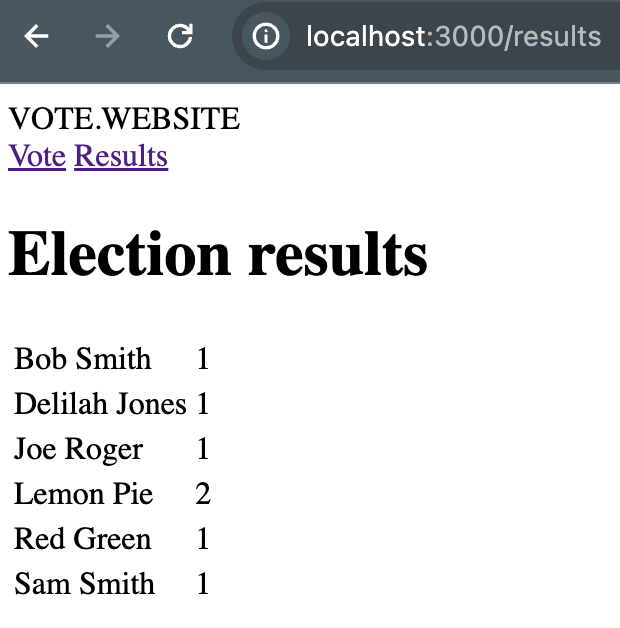
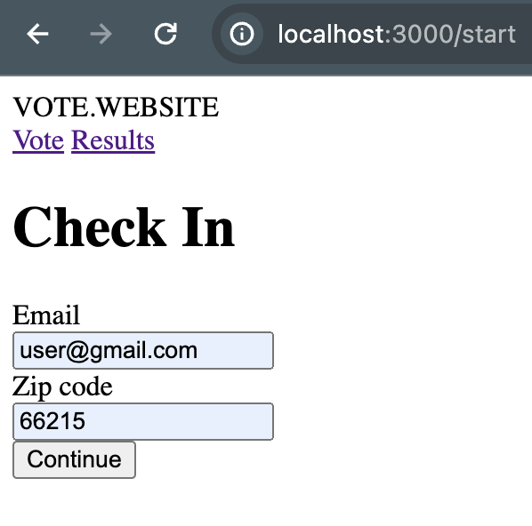
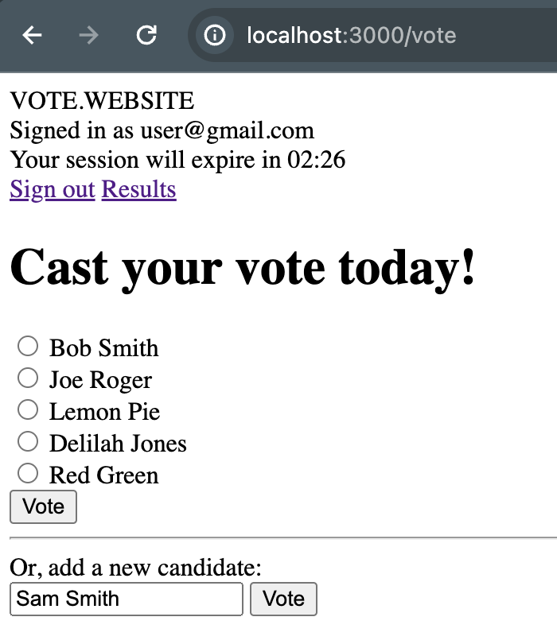

[Assignment Description](assignment_description.md)

## Setup
Built with Rails 7.1.2 and Ruby 3.2.2
```bash
bundle install
rails db:migrate
rails s
```

## A Tour

### Results
Both the root url (localhost:3000) and localhost:3000/results display the election results page. Candidates are listed in alphabetical order, along with their vote totals



### Signing In/Up
Clicking the Vote Link will bring you to the check in page.  This endpoint uses a find or create by method to either lookup an existing voter by the email, or create a new voter with the given email.


### Voting
When you check in, your voter uuid and a 5 minute expiration timestamp are written to the session.  You can vote for an existing candidate, or enter your own.
 * When there are 10 candidates on the ballot, you are no longer able to write in additional candidates.
 * If your time runs out, you will be redirected to the check in page and will need to sign back in to continue.
   * The 5 minute session timer isn't dynamic, but it will show the new value when you refresh the page.  When you submit your vote or refresh the page after the count down is complete, you are redirected back to the login page.
 * When you submit your vote, you are redirected to the results page and logged out



## Specs
There are a handful of rspec tests on the models and requests.  Mainly for validating the redirects and session-level security access for the voting page.

## Design
Visually, I haven't worked on front end in a while, so things are pretty plain.  There isn't javascript animating the count-down on the session time out, or anything auto-updating the results page.

The Model design is very basic.  Voters Belong to Candidates.  Since this is a single-ballot election, there's no need for a middle-man model linking voters to the one candidate they're voting for.
